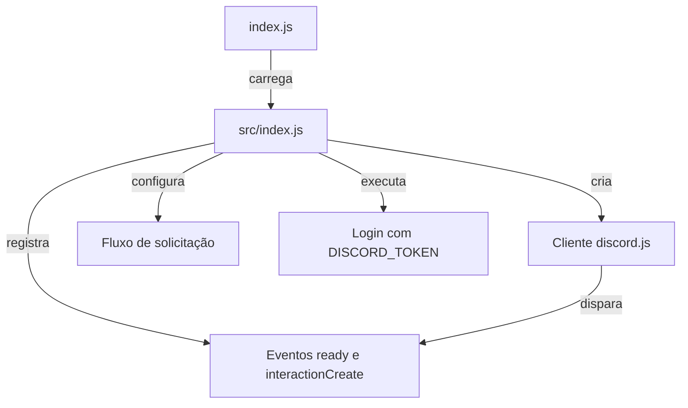

# Entrypoints do Bot

## Visão geral

O processo possui dois pontos de entrada encadeados.

- **`index.js`** atua como bootstrap mínimo: carrega `src/index.js` e transfere a execução para o entrypoint operacional.
- **`src/index.js`** compõe o cliente Discord, registra os handlers de interação, inicializa os mecanismos de deduplicação e realiza o login usando `process.env.DISCORD_TOKEN`.

A composição é síncrona na entrada e assíncrona no processamento das interações:

- O carregamento de `src/index.js` configura o processo.
- Os eventos `ready` e `interactionCreate` conduzem a execução do bot após a inicialização do cliente.

---

## Encadeamento dos entrypoints



O relacionamento entre os arquivos é explícito em `index.js`, que executa:

```js
require('./src/index.js');
```

Não há outra passagem de controle demonstrada entre os dois arquivos: toda a lógica de inicialização e operação está concentrada em `src/index.js`.

---

# Entrypoint raiz

## `index.js`

> **Visibilidade:** `public`  
> **Tipo:** `function`

Ponto de entrada raiz que carrega o entrypoint operacional em `src/index.js`.

### Operação executada

```js
require('./src/index.js');
```

Esse arquivo possui apenas essa responsabilidade.

Ele **não**:

- cria o cliente Discord;
- registra eventos;
- executa `client.login()`.

Todas essas responsabilidades pertencem a `src/index.js`.

---

# Entrypoint operacional

## `src/index.js`

> **Visibilidade:** `public`  
> **Tipo:** `function`

Inicializa o cliente Discord, registra os eventos do bot, processa comandos, menus e modais, controla a deduplicação em memória e inicia o login.

---

## Importações e composição

`src/index.js` importa os seguintes recursos:

### Bibliotecas

- `Client`
- `GatewayIntentBits`
- `ActionRowBuilder`
- `StringSelectMenuBuilder`
- `StringSelectMenuOptionBuilder`
- `EmbedBuilder`
- `MessageFlags`

(importados de **discord.js**)

Além disso:

- `crypto`, utilizado para calcular a impressão digital (hash) das mensagens.

### Módulos internos

#### `./config`

- `ENV`

#### `./utils`

- `debug`
- `safeReply`
- `safeShowModal`
- `safeDeferReply`

#### `./modals`

- `criarModal`

#### `./menu`

- `obterOpcoesDoCanal`

#### `./destinos`

- `obterDestinoPorTipo`
- `resolverCanalDestino`

#### `./formatter`

- `criarMensagemSolicitacao`

Esses módulos são pontos de delegação do entrypoint. O código de `src/index.js` utiliza suas funções exportadas, enquanto toda a inicialização permanece centralizada nesse arquivo.

---

## Criação do cliente

O cliente Discord é criado utilizando apenas a intent `Guilds`:

```js
const client = new Client({
    intents: [GatewayIntentBits.Guilds]
});
```

Durante as respostas ao usuário também é utilizado:

```js
MessageFlags.Ephemeral
```

para mensagens efêmeras.

---

## Estado de inicialização e deduplicação

`src/index.js` mantém dois mapas em memória:

- `processedInteractions`
  - registra IDs de interações já processadas.

- `recentSends`
  - registra chaves de envio formadas pelo canal e pelo hash da mensagem.

### Tempos de retenção

| Constante | Valor |
|-----------|------:|
| `CLEANUP_INTERVAL_MS` | `30_000` |
| `INTERACTION_RETENTION_MS` | `30_000` |
| `SEND_RETENTION_MS` | `60_000` |

A função `cleanupCaches()` remove entradas expiradas.

Ela é executada através de:

```js
setInterval(...)
```

e recebe:

```js
.unref()
```

evitando que o timer mantenha o processo ativo sozinho.

---

# Registro de eventos

## Evento `ready`

Registrado utilizando:

```js
client.once(...)
```

Ao conectar, registra uma mensagem semelhante a:

```text
Bot conectado como <bot.user.tag>
```

Esse evento é executado apenas uma vez.

---

## Evento `interactionCreate`

Registrado utilizando:

```js
client.on(...)
```

Esse handler concentra praticamente toda a lógica funcional do bot.

---

# Fluxo do comando `/solicitar`

Quando a interação corresponde ao comando:

```text
/solicitar
```

o entrypoint:

1. Obtém as opções através de:

```js
obterOpcoesDoCanal(interaction, ENV)
```

2. Cria um `StringSelectMenuBuilder` com ID:

```text
menu_solicitacao
```

3. Converte cada opção em `StringSelectMenuOptionBuilder`.

4. Adiciona o menu a uma `ActionRowBuilder`.

5. Cria um `EmbedBuilder` com o título:

```text
Solicitações do bot
```

6. Responde utilizando:

```js
safeReply(...)
```

com:

```js
MessageFlags.Ephemeral
```

Caso `safeReply()` retorne um valor falso, o processamento é encerrado após registrar uma mensagem de depuração.

---

# Fluxo do menu `menu_solicitacao`

Quando:

```text
customId === "menu_solicitacao"
```

o código:

1. lê:

```js
interaction.values[0]
```

2. chama:

```js
criarModal(...)
```

Se nenhum modal for criado:

```text
Tipo de solicitação inválido.
```

Caso contrário:

```js
safeShowModal(...)
```

é utilizado para apresentar o modal ao usuário.

---

# Fluxo da submissão de modal

Quando:

```text
customId começa com "modal_"
```

o entrypoint executa:

1. `safeDeferReply()`;
2. obtém o destino usando `obterDestinoPorTipo()`;
3. valida `channelId`;
4. resolve o canal através de `resolverCanalDestino()`;
5. verifica se o canal existe e aceita mensagens;
6. gera a mensagem usando `criarMensagemSolicitacao()`;
7. calcula um hash MD5 contendo:
   - canal;
   - tipo;
   - autor;
   - mensagem;
8. monta `sendKey`;
9. evita envios duplicados consultando `recentSends`;
10. envia a mensagem utilizando `allowedMentions`;
11. edita a resposta com o link da mensagem enviada.

---

# Inicialização do login

Ao final de `src/index.js` é executado:

```js
client.login(process.env.DISCORD_TOKEN);
```

O token é obtido diretamente das variáveis de ambiente.

A variável:

```text
SUPORTE_ROLE_ID
```

também é lida de `process.env` durante a construção de `allowedMentions` e da mensagem enviada.

---

# Tratamento de erros

> **⚠️ Atenção**

O entrypoint depende das seguintes variáveis de ambiente:

- `DISCORD_TOKEN`
- `SUPORTE_ROLE_ID`

Esses valores **não** são definidos em `index.js` nem em `src/index.js`. Eles precisam existir antes da inicialização do processo.

Todo o processamento de `interactionCreate` está protegido por:

```js
try {
    ...
} catch (err) {
    ...
}
```

O tratamento executa:

- ignora os erros Discord `10062` e `40060`, registrando apenas `debug`;
- envia outros erros para:

```js
console.error(...)
```

- caso a interação já tenha sido respondida, utiliza:

```js
interaction.editReply(...)
```

- caso contrário, tenta responder com uma mensagem efêmera;
- eventuais falhas ao notificar o usuário são capturadas separadamente e registradas no console.

Esse fluxo mantém o erro dentro do ciclo da própria interação e evita que uma falha de notificação substitua o erro original.

---

# Inventário dos módulos internos utilizados

O entrypoint depende dos seguintes módulos:

| Módulo | Responsabilidade |
|---------|------------------|
| `./config` | fornece `ENV` |
| `./utils` | fornece `debug`, `safeReply`, `safeShowModal` e `safeDeferReply` |
| `./modals` | fornece `criarModal` |
| `./menu` | fornece `obterOpcoesDoCanal` |
| `./destinos` | fornece `obterDestinoPorTipo` e `resolverCanalDestino` |
| `./formatter` | fornece `criarMensagemSolicitacao` |

O comportamento interno desses módulos não faz parte desta documentação. Aqui eles são apresentados apenas pelas funções efetivamente importadas e utilizadas durante a inicialização e o processamento das interações.
